# Quiz Application

🚀 **Overview**

Check out the live demo of the project [here](https://quizraf.pythonanywhere.com).

## Screenshots

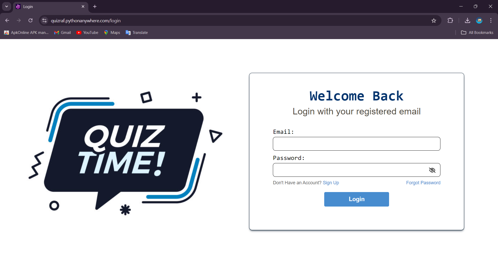
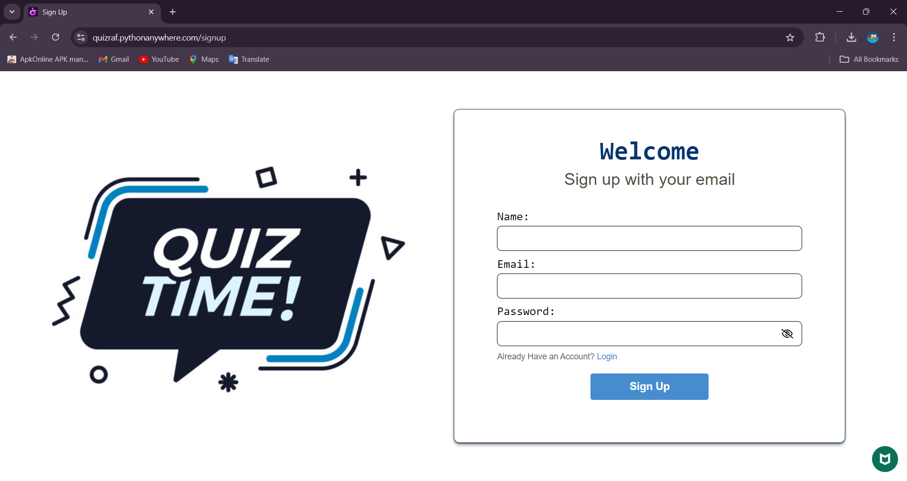
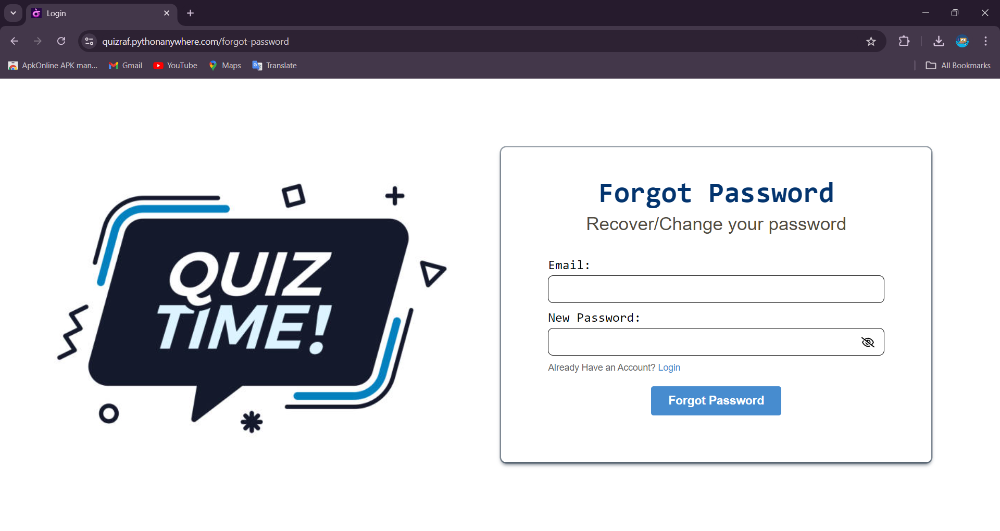
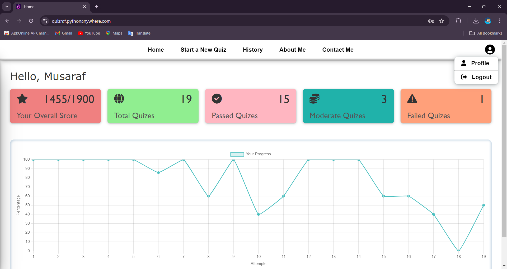
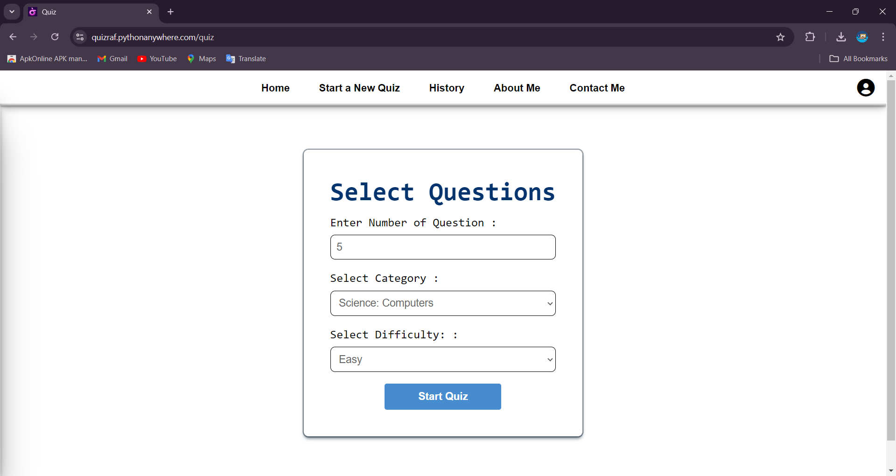
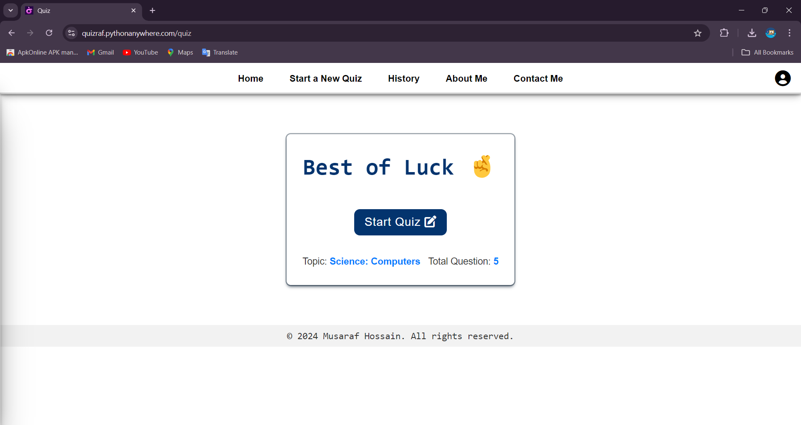
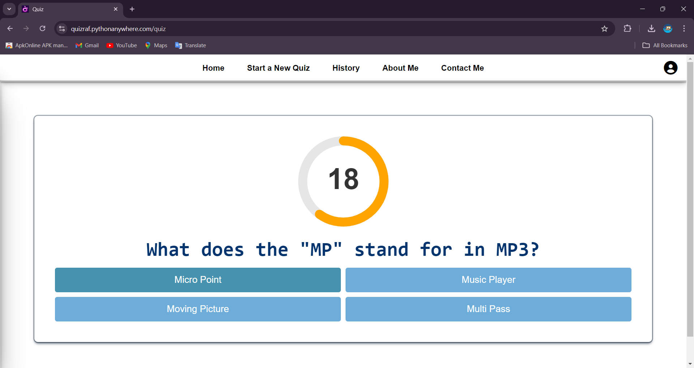
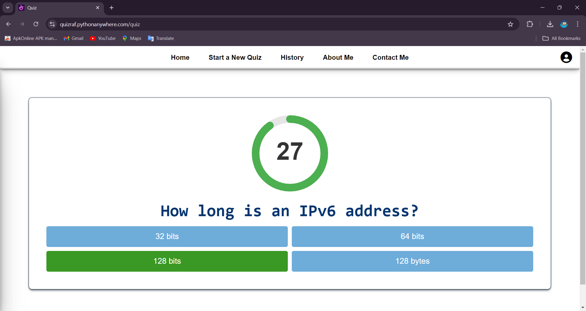
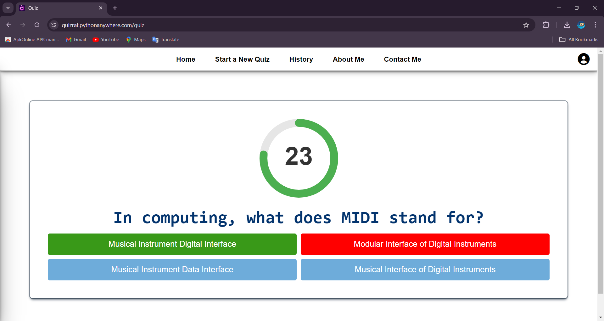
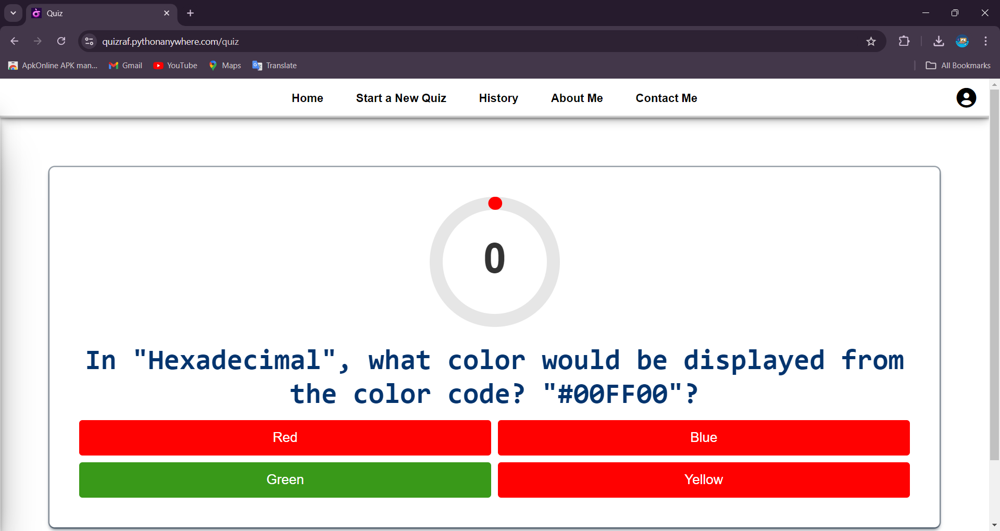
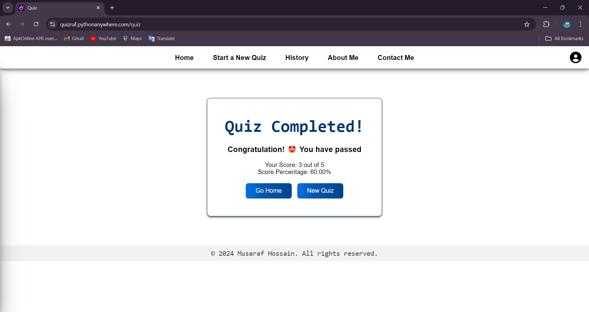
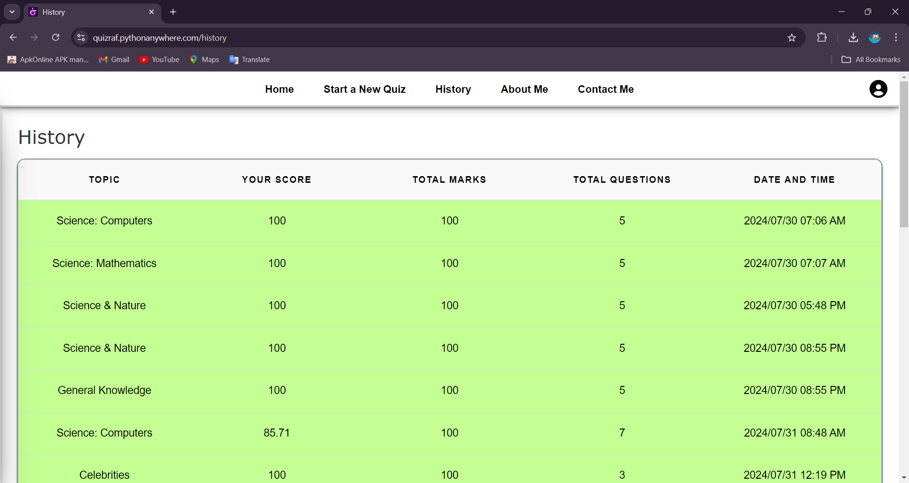
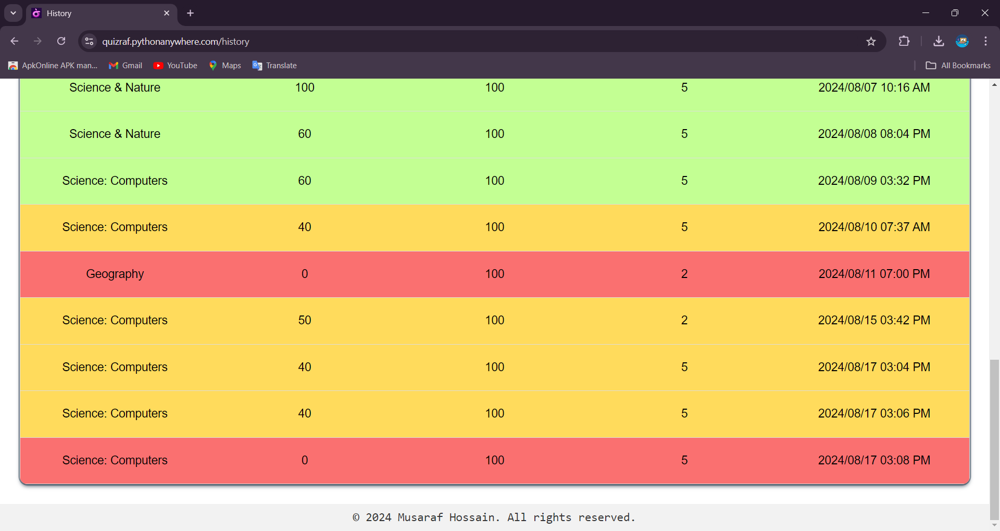
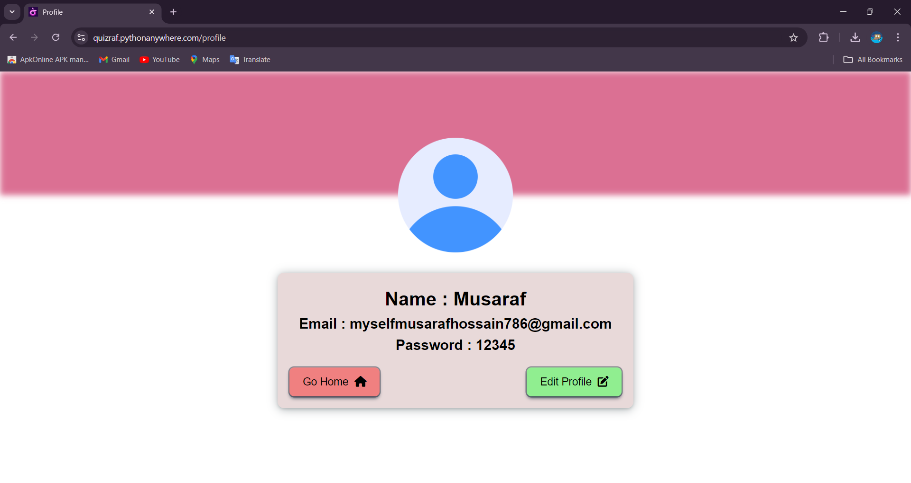

## Features

- **User Authentication**: Secure login and signup with OTP verification.
- **Dashboard**: View total points, quizzes taken, passed quizzes, moderate quizzes, failed quizzes, and track progress with a chart graph.
- **Navigation**: Intuitive header with links to Home, Quiz, History, About Me, and Contact Me, along with a profile icon for easy access to profile settings and logout.
- **Quiz Functionality**: Select number of questions, topic, and difficulty. Real-time feedback with a 30-second timer and results displayed at the end.
- **History Tracking**: Detailed history of past quizzes including topic, number of questions, correct answers, percentage, and date/time.
- **Profile Management**: View and edit profile information such as name, email, and password.
- **Dynamic Question Fetching**: Questions are fetched dynamically from an API, ensuring the quiz content is up-to-date and diverse.

## Technologies Used

- **Frontend**: HTML, CSS, JavaScript
- **Backend**: Flask
- **Database**: SQLAlchemy with SQL database
- **API Integration**: External API for dynamic question fetching
- **Authentication**: OTP-based verification

## Installation

1. **Clone the Repository**

   ```bash
   git clone https://github.com/yourusername/quiz-application.git
   cd quiz-application
   ```
2. **Set Up the Backend**

    Create a virtual environment:

    ```bash
    python -m venv venv
    source venv\bin\activate  # On Windows use `venv\Scripts\activate`
    ```
    Install dependencies:

    ```bash
    pip install -r requirements.txt
    ```
    Set up the database and run the Flask server:

    ```bash
    python app.py
    ```
2. **Access the Application**

    Open your browser and go to http://localhost:5000.

##Contributing
Feel free to fork the repository and submit pull requests. For any issues or suggestions, please open an issue in the GitHub repository.

##License
This project is licensed under the MIT License - see the LICENSE file for details.

##Contact
For any questions or feedback, please reach out to myselfmusarafhossain786@gmail.com.